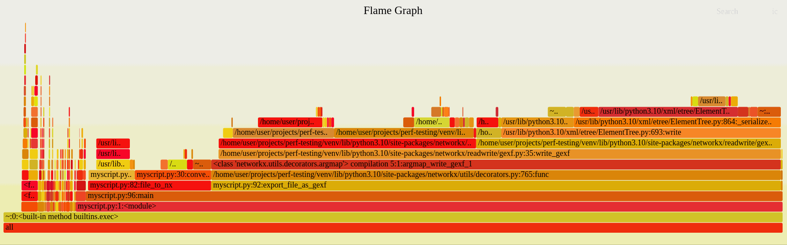

# Flame Graphs for Python Examples

This repo includes a Dockerfile and examples showing how to get flame graphs for Python code and accompanies
[this post](https://seeinglogic.com/posts/flame-graphs-explained/)
that goes into more depth.



## Quickstart

If you have docker installed, run the following command:

```bash
./build_and_run.sh
```

Which will build an image with the right tools and generate an example flame
graph. If you want to play inside the container, just override the entrypoint:

```bash
docker run --rm -it --entrypoint=/bin/bash -v `pwd`:/host $TAG
```

If you don't have docker and are running on Ubuntu or Debian, you can mimic the
Dockerfile and install the tools on your host:

```bash
apt-get install -y git wget curl vim build-essential python3 python3-pip python-is-python3
git clone --depth=1 https://github.com/brendangregg/FlameGraph
pip install flameprof 2>/dev/null
```

Then use any of the `make_*.sh` scripts to start making flame graphs.

## Scripts

There are a few scripts demonstrating generating a flame graph in different ways:

1. make_flameprof_flamegraphs.sh: Generic script to make a flame graph based on the specified python file
2. make_self_profiled_flamegraph.sh: A script showing how to do the same thing when the script contains code invoking `cProfile` (as in [example.py](./basic-example/example.py))
3. make_inferno_flamegraphs.sh: Generic script that uses [inferno](https://github.com/jonhoo/inferno) instead of the classic [FlameGraph](https://github.com/brendangregg/FlameGraph) tools.

[make_all.sh](./make_all.sh) invokes all of them and shows how to use them, but
it takes longer to complete.

## Example Targets

Included are three examples that show different kinds of Python programs where
profiling is helpful:

1. basic-example/example.py: A simple example to demonstrate flame graphs and the use of [cProfile](https://docs.python.org/3/library/profile.html#module-cProfile) to profile specific parts of the code
2. sqlite-example/test_insert.py: Inserts a large number of random rows in a sqlite3 db to show where the bottleneck really is...
3. aoc-2023-19/a.py: An example solution to a specific [Advent of Code challenge](https://adventofcode.com/2022/day/19) that takes a while.
3. aoc-2023-19/a-opt.py: The same file after a simple optimization made based on looking at the flame graph (runs about 2x faster).

## Thanks!

I hope this helps, feel free to open an issue if there's something you want to see, or follow me on GitHub or [Twitter](https://twitter.com/seeinglogic) for more.
